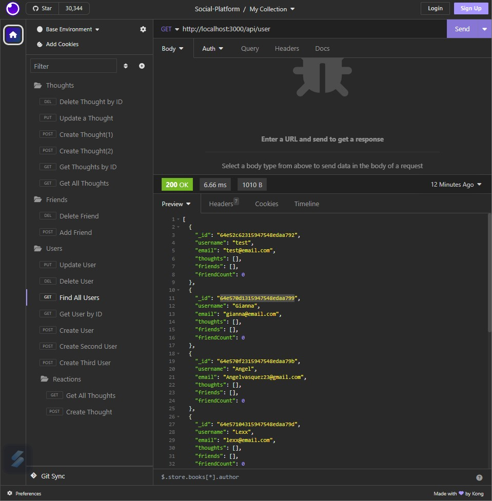

# Social-Platform

## Description
This application is an API for a social network web application where users can share their thoughts, react to friends’ thoughts, and create a friend list.

## Technology
* Javascript
* Node.js
* Express.js
* MongoDB
* Mongoose
* Nodemon
* Moment

## Installation
To run this project, install it locally using npm:

npm start
npm test

## Screenshot

## Links

